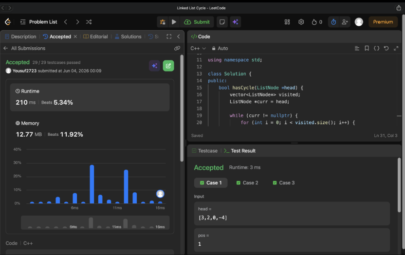

# Problem Link 
https://leetcode.com/problems/linked-list-cycle/description/
## SS of submission


```C++
#include <iostream>
#include <vector>

using namespace std;

struct ListNode {
    int val;
    ListNode *next;
    ListNode(int x) : val(x), next(nullptr) {}
};

class Solution {
public:
    bool hasCycle(ListNode *head) {
        vector<ListNode*> visited;
        ListNode *curr = head;

        while (curr != nullptr) {
            for (int i = 0; i < visited.size(); i++) {
                if (visited[i] == curr) {
                    return true;
                }
            }
            visited.push_back(curr);
            curr = curr->next;
        }

        return false;
    }
};

int main() {
    ListNode node1(3);
    ListNode node2(2);
    ListNode node3(0);
    ListNode node4(-4);

    node1.next = &node2;
    node2.next = &node3;
    node3.next = &node4;
    node4.next = &node2;

    Solution solution;
    bool has_cycle = solution.hasCycle(&node1);

    if (has_cycle) {
        cout << "true" << endl;
    } else {
        cout << "false" << endl;
    }

    ListNode node5(1);
    ListNode node6(2);
    
    node5.next = &node6;

    has_cycle = solution.hasCycle(&node5);

    if (has_cycle) {
        cout << "true" << endl;
    } else {
        cout << "false" << endl;
    }

    return 0;
}
```
