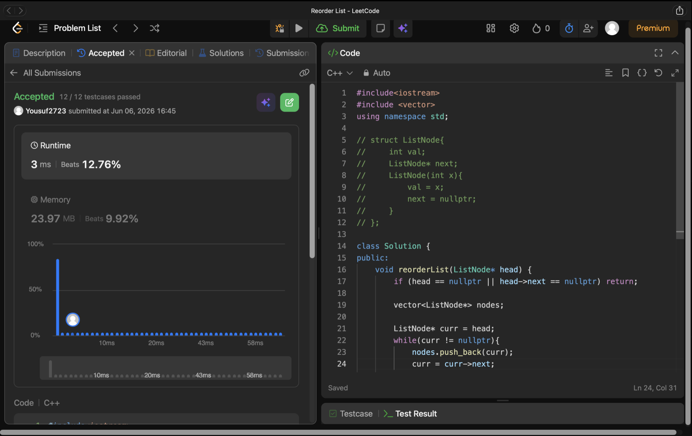

# Problem Link 
https://leetcode.com/problems/reorder-list/submissions/2024136493/

# Brute Force Method

## SS of submission


```C++
#include<iostream>
#include <vector>
using namespace std;

struct ListNode{
    int val;
    ListNode* next;
    ListNode(int x){
        val = x;
        next = nullptr;
    }
};

class Solution {
public:
    void reorderList(ListNode* head) {
        if (head == nullptr || head->next == nullptr) return;

        vector<ListNode*> nodes;

        ListNode* curr = head;
        while(curr != nullptr){
            nodes.push_back(curr);
            curr = curr->next;
        }
        
        int left = 0;
        int right = nodes.size() - 1;

        while (left < right) {
            nodes[left]->next = nodes[right];
            left++;
            if (left == right) break;
            nodes[right]->next = nodes[left];
            right--;
        }

        nodes[left]->next = nullptr;
    }
};
```

# Optimized One

## SS of submission


```C++
#include<iostream>
using namespace std;

struct ListNode{
    int val;
    ListNode* next;
    ListNode(int x){
        val = x;
        next = nullptr;
    }
};

class Solution {
public:
    void reorderList(ListNode* head) {
        if (head == nullptr || head->next == nullptr || head->next->next == nullptr) return;

        // Floyd's Algo
        ListNode* slow = head;
        ListNode* fast = head;
        while (fast != nullptr && fast->next != nullptr) {
            slow = slow->next;
            fast = fast->next->next;
        }

        ListNode* prev = nullptr;
        ListNode* curr = slow->next; 
        slow->next = nullptr; 
        while (curr != nullptr) {
            ListNode* nextTemp = curr->next; 
            curr->next = prev;               
            prev = curr;                     
            curr = nextTemp;                 
        }

        ListNode* first = head;
        ListNode* second = prev;
        while (second != nullptr) {
            ListNode* temp1 = first->next;
            ListNode* temp2 = second->next;

            first->next = second;
            second->next = temp1;

            first = temp1;
            second = temp2;
        }
    }
};
```

## 3 Concept used : 
1) Floyd's slow-Fast algo
2) Reverse LinkedList
3) Merge two LinkedList
