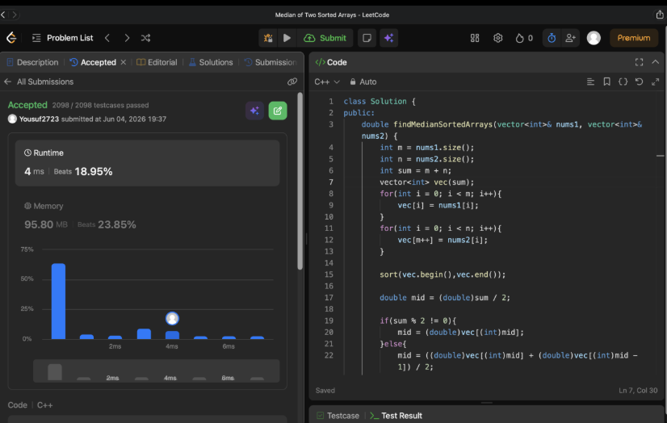

# Problem Link 
https://leetcode.com/problems/median-of-two-sorted-arrays/submissions/2022329570/

## SS of submission


```C++
#include<iostream>
#include<vector>

using namespace std;

double findMedianSortedArrays(vector<int>& nums1, vector<int>& nums2){
    int m = nums1.size();
    int n = nums2.size();
    int sum = m + n;
    vector<int> vec(sum);
    for(int i = 0; i < m; i++){
        vec[i] = nums1[i];
    }
    for(int i = 0; i < n; i++){
        vec[m++] = nums2[i];
    }
    
    sort(vec.begin(),vec.end());

    double mid = (double)sum / 2;

    if(sum % 2 != 0){
        mid = (double)vec[(int)mid];
    }else{
        mid = ((double)vec[(int)mid] + (double)vec[(int)mid - 1]) / 2;
    }
    return mid;
}

int main(){
    int m;
    cout << "Enter m : ";
    cin >> m;
    int n;
    cout << "Enter n : ";
    cin >> n;
    
    vector<int> nums1;
    cout << "Enter nums1 : " << endl;
    for(int i = 0; i < m; i++){
        int ele;
        cin >> ele;
        nums1.push_back(ele);
    }
    
    vector<int> nums2;
    cout << "Enter nums2 : " << endl;
    for(int i = 0; i < n; i++){
        int ele;
        cin >> ele;
        nums2.push_back(ele);
    }
    
    sort(nums1.begin(),nums1.end());
    sort(nums2.begin(),nums2.end());
    
    double median = findMedianSortedArrays(nums1, nums2);
    
    cout << "\nMedian = " << median << endl;
}
```

## Helpful Resources
**This video shows the 100% optimized code**
<p>
Helpfull Youtube video : https://youtu.be/q6IEA26hvXc?si=u_chzOtspMuRvzQu
</p>