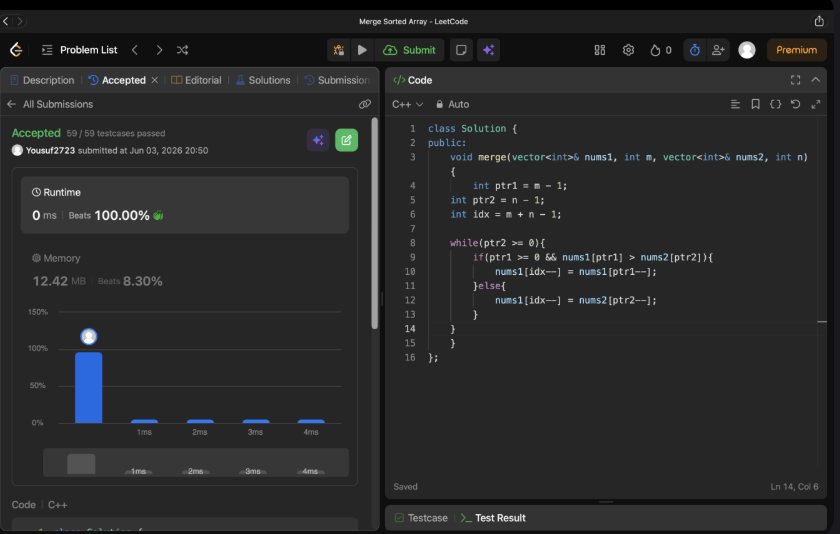

# Problem Link 
https://leetcode.com/problems/merge-sorted-array/description/

## SS of submission


```C++
#include<iostream>
#include<vector>
using namespace std;

// !Approch - 1 : O(nlogn)
// void merge(vector<int>& nums1, int m, vector<int>& nums2, int n){
//     int idx = m;
//     for(int i = 0; i < n; i++){
//         nums1[idx++] = nums2[i];
//     }
//     sort(nums1.begin(),nums1.end());
// }

// !Approch - 2 O(m+n)
void merge(vector<int>& nums1, int m, vector<int>& nums2, int n){
    int ptr1 = m - 1;
    int ptr2 = n - 1;
    int idx = m + n - 1;

    while(ptr2 >= 0){
        if(ptr1 >= 0 && nums1[ptr1] > nums2[ptr2]){
            nums1[idx--] = nums1[ptr1--];
        }else{
            nums1[idx--] = nums2[ptr2--];
        }   
    }
}

int main(){
    // input --> m and n
    int m;
    cout << "Enter m = ";
    cin >> m;
    int n;
    cout << "Enter n = ";
    cin >> n;
    // Vector - 1
    vector<int> nums1(m+n);
    cout << "Enter vector - 1 elements:" << endl; 
    for(int i = 0; i < m; i++){
        cin >> nums1[i];
    }
    // Vector - 2
    vector<int> nums2;
    cout << "Enter vector - 2 elements:" << endl; 
    for(int i = 0; i < n; i++){
        int ele;
        cin >> ele;
        nums2.push_back(ele);
    }

    merge(nums1, m, nums2, n);

    // Output of Vec - 1
    cout << "vector - 1 : " << endl;
    for(int i = 0; i < nums1.size(); i++){
        cout << nums1[i] << " ";
    }
}
```
